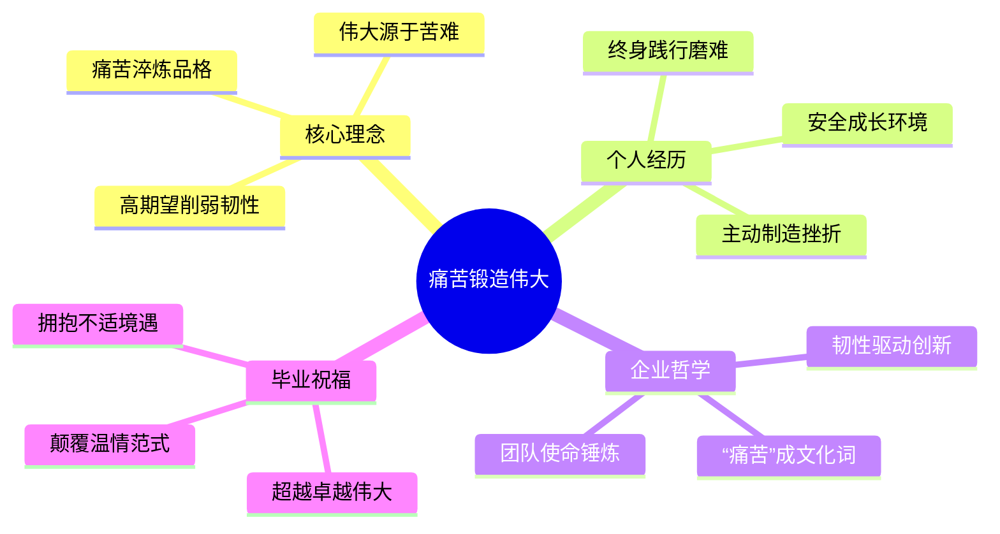

# Jensen Huang wishes Stanford graduates ample doses of pain & suffering #stanford #success #business

```mermaid
mindmap
  root((痛苦锻造伟大))
    核心理念
      高期望削弱韧性
      痛苦淬炼品格
      伟大源于苦难
    个人经历
      安全成长环境
      主动制造挫折
      终身践行磨难
    企业哲学
      “痛苦”成文化词
      团队使命锤炼
      韧性驱动创新
    毕业祝福
      颠覆温情范式
      拥抱不适境遇
      超越卓越伟大
```