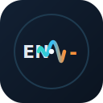

# 本地同声传译播放器（EnglishToChinese）

[English](README.en.md) | [中文](README.md) · [项目主页](https://xjalyn.github.io/EnglishToChinese/) · [GitHub](https://github.com/XJALYN/EnglishToChinese)

<p align="center">
  
</p>

B 站 / YouTube 等英文视频的 **本地流式同声传译**：ASR → 大模型翻译 → CosyVoice TTS，并支持 **AI 一键总结**、**思维导图** 与导出。

<p align="center">
  <video src="demo.mp4" controls width="720" poster="docs/logo.svg">
    演示视频：本地同声传译播放器
  </video>
</p>

<p align="center"><a href="demo.mp4">下载演示视频（demo.mp4）</a></p>

## 为什么不是纯 Electron？

| 能力 | PyQt6 + Python | 纯 Electron |
|------|----------------|-------------|
| mpv 视频嵌入 | 原生支持 | 需 mpv.js / 外挂窗口 |
| faster-whisper | 成熟 Python 生态 | 需子进程或 WASM |
| ffmpeg 音频分流 | 直接调用 | 需打包二进制 |
| AI 面板 / 配置 UI | QWebEngine 渲染 | 天然 Web UI |

**当前架构**：Python 做重活（播放 / ASR / 翻译 / TTS），UI 用 PyQt6；同时提供 **Electron 可选前端** 连接同一 Python API。

```
┌─────────────────────────────────────────────────────────┐
│  PyQt6 主应用 (python main.py)                          │
│  ├─ mpv 视频播放 + 同声传译管线                          │
│  ├─ 右侧面板: AI 总结 | 思维导图 | 导出                  │
│  └─ 大模型配置对话框 (可视化)                            │
├─────────────────────────────────────────────────────────┤
│  Electron 可选前端 (cd electron && npm run electron)    │
│  └─ 连接 FastAPI 后端 → 配置 / 总结 / 导图 / 导出       │
└─────────────────────────────────────────────────────────┘
```

## 功能

### 同声传译
- Bilibili / YouTube 等链接 → yt-dlp 直链 → mpv 播放（原声可静音）
- faster-whisper 本地 ASR → 大模型翻译 → CosyVoice TTS
- 实时字幕叠加

### AI 一键总结
- 播放过程中自动累积双语字幕
- 调用大模型生成结构化 Markdown 总结
- 自动尝试拉取 B 站已有字幕作为补充

### 思维导图
- 基于字幕 + AI 总结，生成 Mermaid mindmap
- QWebEngine 可视化预览（需 `PyQt6-WebEngine`）

### 可视化大模型配置
- 全局厂商：百炼 / OpenAI / DeepSeek / 自定义 OpenAI 兼容
- 分别设置：翻译 / 总结 / 思维导图模型
- 保存至 `config.json` 并同步 `.env`（切换厂商会保留各自 API Key）

### 导出
- 总结：Markdown / HTML / JSON
- 思维导图：Markdown（含 mermaid）/ HTML（可浏览器打开）
- 「一键导出全部」批量导出多个文件

## 安装

```bash
pip install -r requirements.txt
brew install mpv ffmpeg
cp .env.example .env   # 填入 API Key；也可读取 ~/.bailian/config.json
```

系统依赖：
- **Python 3**（建议 3.10+）
- **mpv**、**ffmpeg**
- 至少一个大模型 API Key（见下方配置）

## 运行

### 方式一：PyQt6 完整应用（推荐，含视频播放）

```bash
python main.py
```

### 方式二：Electron + Python API

```bash
# 终端 1
python run_api.py

# 终端 2
cd electron && npm install && npm run electron
```

> 视频播放仍在 PyQt6 主应用中；Electron 负责 AI 配置、总结、思维导图。

## 配置

请参考仓库中的 [`.env.example`](https://github.com/XJALYN/EnglishToChinese/blob/main/.env.example)，复制为 `.env` 后填写，**不要**把真实密钥提交到 Git。

### 大模型厂商

| 厂商 | Base URL | 预设模型 |
|------|----------|----------|
| 阿里云百炼 / DashScope（默认） | `https://dashscope.aliyuncs.com/compatible-mode/v1` | qwen-plus, qwen-max, qwen-turbo, qwen-long |
| OpenAI | `https://api.openai.com/v1` | gpt-4o, gpt-4o-mini, gpt-4-turbo |
| DeepSeek | `https://api.deepseek.com` | deepseek-chat, deepseek-reasoner |
| 自定义 OpenAI 兼容 | 自行填写 | 自行填写 |

### 环境变量（摘自 `.env.example`）

| 变量 | 说明 | 默认 |
|------|------|------|
| `LLM_PROVIDER` | 当前厂商（`dashscope` / `openai` / `deepseek` / `custom`） | `dashscope` |
| `LLM_API_KEY` | 当前厂商 API Key | — |
| `LLM_BASE_URL` | 自定义厂商 Base URL | 按厂商预设 |
| `DASHSCOPE_API_KEY` | 百炼 Key（向后兼容） | — |
| `OPENAI_API_KEY` / `DEEPSEEK_API_KEY` | 各厂商 Key（可选） | — |
| `TRANSLATE_MODEL` | 同声传译 | `qwen-plus` |
| `SUMMARY_MODEL` | AI 总结 | `qwen-plus` |
| `MINDMAP_MODEL` | 思维导图 | `qwen-plus` |
| `WHISPER_MODEL` | 本地 ASR（`tiny` / `base` / `small` / `medium`） | `base` |
| `TTS_VOICE` | CosyVoice 音色 | `longxiaochun_v3` |
| `HF_ENDPOINT` | HuggingFace 镜像 | `https://hf-mirror.com` |

也可在应用内点击「大模型配置」进行可视化设置。

## API 端点（FastAPI :8765）

| 方法 | 路径 | 说明 |
|------|------|------|
| GET | `/api/settings` | 读取配置 |
| PUT | `/api/settings` | 更新配置 |
| GET | `/api/transcript` | 当前字幕 |
| POST | `/api/summary` | AI 总结 |
| POST | `/api/mindmap` | 生成思维导图 |

## 项目主页与仓库

| 用途 | 链接 |
|------|------|
| 宣传主页（GitHub Pages） | https://xjalyn.github.io/EnglishToChinese/ |
| 代码仓库 | https://github.com/XJALYN/EnglishToChinese |
| Pages 设置 | https://github.com/XJALYN/EnglishToChinese/settings/pages |

本地预览主页：

```bash
# 在仓库根目录
python -m http.server 8080
# 浏览器打开 http://127.0.0.1:8080/
```

## 贡献

欢迎提交 Issue 与 Pull Request：https://github.com/XJALYN/EnglishToChinese/issues

## 开源协议

本项目采用 [GNU General Public License v2.0](https://www.gnu.org/licenses/old-licenses/gpl-2.0.html)（GPL-2.0）发布，详见仓库根目录 [`LICENSE`](https://github.com/XJALYN/EnglishToChinese/blob/main/LICENSE)。
